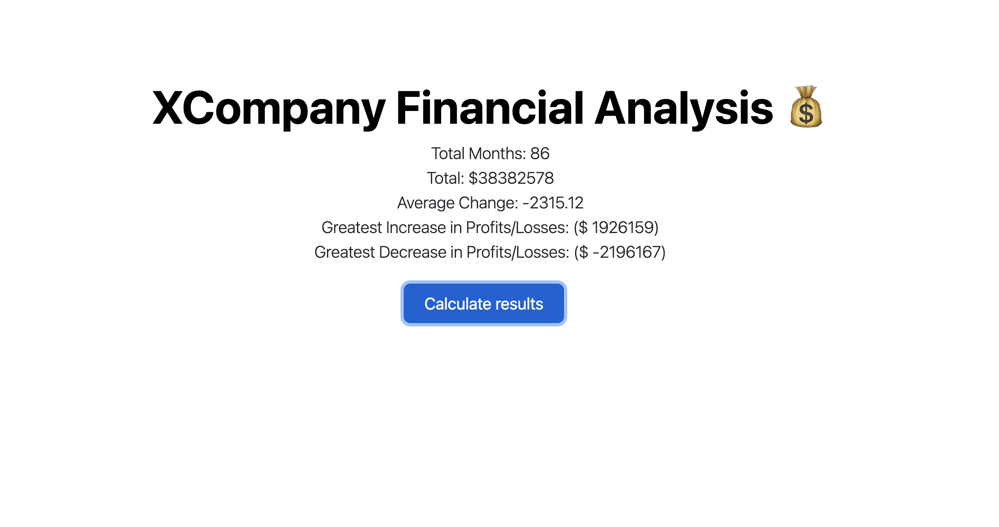

# console-finances
JavaScript Fundamentals: Console Finances

## Description

JavaScript Fundamentals: Console Finances.

EDX bootcamp homework were we are tasked with creating code for analyzing the financial records of a company. 

Here we learn to use javascript 'for loops' to calculate total amounts, average and min/max amounts.

## Usage

https://vilmaglynn.github.io/console-finances/

## Credits

Bootstrap used to create initial screen

## License

MIT License

Copyright (c) 2023 Vilma Hernandez

